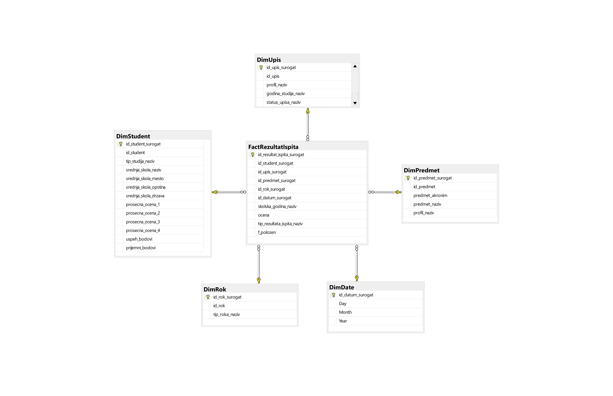
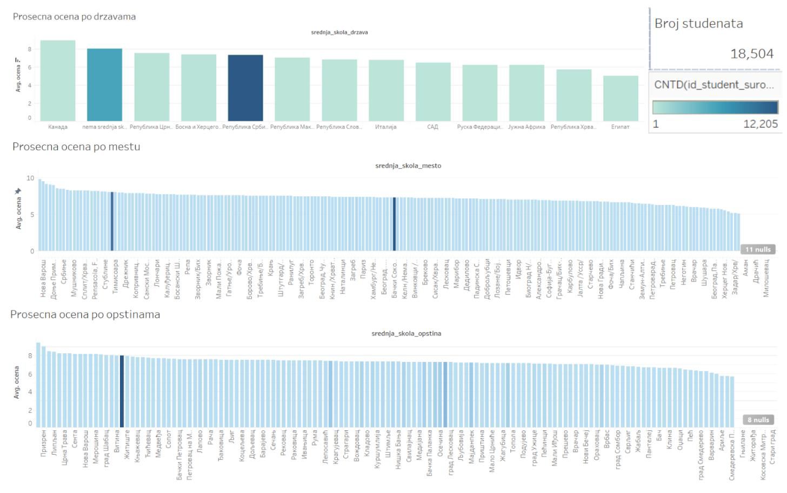
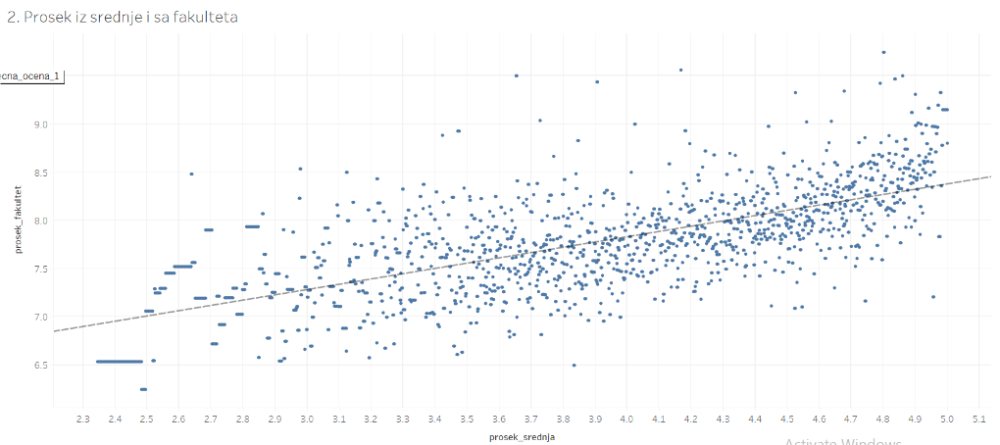
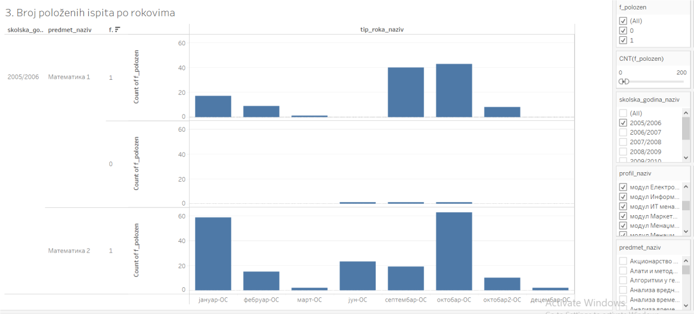
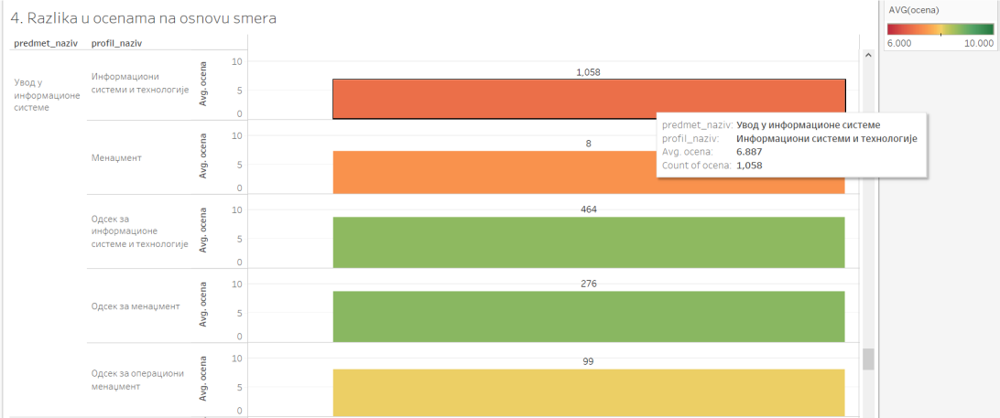

# About the project

This project was developed as part of the *Data Warehousing* course in the *Business Analytics* master’s program at the Faculty of Organizational Sciences, University of Belgrade. The project focuses on constructing a **star schema** data warehouse and implementing an **ETL** (Extract, Transform, Load) pipeline to address key research questions using data from an **OLTP** (Online Transaction Processing) database — **University Student Administration**.

The data used in this project is not real but consists of mixed and anonymized records, serving as a simulation for educational purposes. The ETL process was implemented using **SQL Server Management Studio** (SSMS) and SQL **Server Integration Services** (SSIS).

## Scope of the project - Research questions

This project tracks two main business processes: **monitoring student success** and **analyzing course exam performance**. Each of these processes includes two key research questions, as outlined here:

**Monitoring student success**:
- Do demographic characteristics of students affect their academic success?
- Are high school performance and entrance exam results good predictors of student success in university?

**Analyzing course exam performanse**:
- Are there specific exams that students tend to postpone until the October exam period?
- Does a student’s study program affect their grades in specific subjects?

The first two research questions focus on tracking student success in exams, while the last two questions focus on analyzing subjects and comparing difficulty levels across study modules.

## Project Components

### 1. OLTP Data Source - University Student Administration Database

- The OLTP database is the primary data source, holding detailed transactional data about students, including enrollment, course performance, exam results, and demographic data, provided by the course professor.
- For the full-size picture of the OLTP database, as an ER diagram, [click here](https://raw.githubusercontent.com/NovakMastilovic/SSIS_ETL_University_DB/refs/heads/main/Diagram_OLTP_UniversityDatabase.png).

### 2. Identifying Key Tables from the OLTP Database

To define our Data Warehouse structure (including dimension and fact tables), we analyzed our research questions to identify the relevant tables for inclusion. A BI Model Canvas was used to ensure that the data warehouse would capture all necessary insights by addressing key questions such as: *Who*, *What*, *Where*, *When*, *How*, and *How Many*. Summary of BI model canvas is shown in the Table 1 below:

| Question      | Answered by Table                                                         |
|---------------|---------------------------------------------------------------------------|
| **Who**       | Student                                                                   |
| **What**      | Course, High School, Enrollment                                           |
| **Why**       | Not applicable in this model                                              |
| **Where**     | Place, Municipality, Country                                              |
| **When**      | Exam Date, Exam Period, Academic Year                                     |
| **How**       | Study Type, Exam Type, Enrollment Status, Profile, Course Plan, Academic Year |
| **How Many**  | Exam Results                                                              |

*Table 1 - BI model Canvas*

### 3. Data Warehouse Star Schema Design

Based on the analyzed tables through the BI Model Canvas, the following structure represents the proposed Data Warehouse star schema in *Diagram 1*.

*Diagram 1 - Data Warehouse Star Schema*

The star schema consists of a central fact table (`FactRezultatIspita`) surrounded by dimension tables (`DimStudent`, `DimPredmet`, `DimRok`, `DimUpis`, `DimDate`). This structure was achieved through a denormalization process, simplifying the OLTP database tables into a structure optimized for analytical queries based on the research questions initially defined.

#### Fact Table
- **`FactRezultatIspita`**: This table serves as the central fact table and records each exam attempt by students.

#### Dimension Tables

- **`DimStudent`**: Created by joining tables `student`, `sif_tip_studija`, `sif_srednja_skola`, `sif_mesto`, `sif_opstina`, and `sif_drzava`. This dimension stores demographic and academic information about each student.

- **`DimPredmet`**: This dimension was created by combining the tables `profil`, `predmeti_po_planovima`, and `predmet` from the OLTP database.

- **`DimRok`**: Created by merging tables `sif_tip_roka` and `sif_rok`, this dimension provides details about the exam period.

- **`DimUpis`**: This dimension contains enrollment details, created from the `upis` table in the OLTP database.

- **`DimDate`**: A necessary dimension for tracking exam dates, even though our research questions do not specifically require a time dimension.

### 4. ETL Process

The ETL process was developed using SQL Server Management Studio and Visual Studio (SSIS packages) to load data from the **Studenti** database into the **Studenti_Projekat** Data Warehouse - mentioned above. The process is organized into a series of packages, structured to handle both dimension and fact tables.

#### 4.1 Package: Execute

The **Execute** package serves as the main orchestrator, managing the sequence in which all packages are executed shown in *Diagram 2*. A sequential container defines the order, ensuring all dimension tables are loaded before the fact table to preserve referential integrity.

The execution sequence is as follows:
1. Load all dimension tables (`DimDate`, `DimStudent`, `DimRok`, `DimPredmet`, `DimUpis`).
2. Load the fact table (`FactRezultatIspita`).

*Diagram 2 - Sequence Container in SSIS*

#### 4.2 Package: Dimension and Fact Tables

Each dimension table is populated through its own dedicated package, which includes two primary tasks: **Execute SQL Task** and **Data Flow Task**. The **Execute SQL Task** recreates the dimension table before each load to prevent data duplication. The **Data Flow Task** extracts, transforms, and loads data from relevant source tables.

The dimension packages are as follows:
- **DimStudent**: Aggregates student demographics and high school details from various tables.
- **DimRok**: Loads information for each exam period, ensuring each session is uniquely represented.
- **DimPredmet**: Compiles course details, linking subjects to study programs.
- **DimDate**: Stores exam dates (day, month, year) for time-based analyses.
- **DimUpis**: Tracks enrollment details, including academic year, study profile, and enrollment status.

The fact table, `FactRezultatIspita`, is also populated through its own package with the same two primary tasks. The **Execute SQL Task** creates the fact table and re-establishes foreign key relationships with dimension tables to maintain referential integrity. The **Data Flow Task** maps exam data to relevant surrogate keys from each dimension table, capturing key details such as student ID, course, enrollment, and exam period.

### 5. Analysis, Visualisation and Conclusions

This chapter presents the results of our analysis, structured to answer each of the initial research questions. Data visualization was performed in **Tableau**, allowing us to create dashboards that display relevant trends, correlations, and anomalies. Each sub-section addresses a specific research question, showing visualizations used and the conclusions drawn based on the data.

#### 5.1 Research Question 1: Do demographic characteristics of students affect their academic success?

To address this question, we created a dashboard displaying students' average grades segmented by demographic factors, including country, city, and municipality of origin.

 
- **Conclusion**: Our analysis revealed that most students come from Serbia, followed by smaller groups from Montenegro and Bosnia. However, data inconsistencies, such as misclassified regions and incorrect municipalities, make it challenging to derive a reliable conclusion about demographic impact.

#### 5.2 Research Question 2: Are high school performance and entrance exam results good predictors of university success?

For this question, we analyzed the relationship between students' high school averages and their university grades.

- **Visualization**: This scatter plot shows a trend line representing the relationship between high school performance (x-axis) and university GPA (y-axis). Each point represents an individual student, allowing us to observe clusters and outliers.

- **Conclusion**: A positive correlation exists between high school performance and university success, with most students maintaining similar performance levels across both stages. Exceptions include some students who improved significantly and others whose performance declined, indicating that while high school performance is a moderate predictor of university success, it is not absolute.

#### 5.3 Research Question 3: Are there specific exams that students tend to postpone until the October exam period?

This analysis examines if certain exams are more frequently delayed to later exam periods, suggesting higher difficulty levels.

- **Visualization**: This dashboard includes bar charts showing the number of students attempting each exam in each period. Filters allow users to analyze the data by school year, study program, and course.

- **Conclusion**: The data indicates that exams like **Mathematics 1** and **Mathematics 2** are frequently postponed, with a larger number of students attempting them later in the year. This suggests that these courses might be particularly challenging for students.

#### 5.4 Research Question 4: Does a student’s study program affect their grades in specific subjects?

To explore if there’s a relationship between study programs and student performance, we compared average grades across programs for various subjects.

- **Visualization**: This heat map shows subjects on the y-axis and average grades by study program on the x-axis. Colors range from dark green (high average grades) to dark red (low average grades), providing a visual representation of performance differences.

- **Conclusion**: Although some subjects, such as **Introduction to Information Systems**, display clear performance differences between study programs, data inconsistency in student distribution across programs affects result accuracy (biased sample from the population in the sample data). Relevant conclusions can only be drawn for well-balanced subject-program combinations.

---

**Project developed as part of the Data Warehousing course, Faculty of Organizational Sciences, University of Belgrade.**
