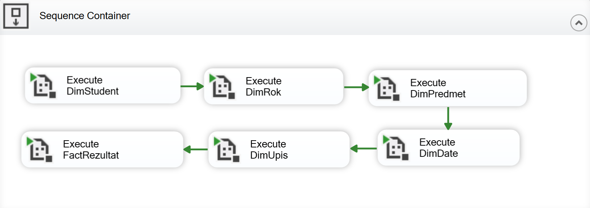

# About the project

This project was developed as part of the *Data Warehousing* course in the *Business Analytics* master’s program at the Faculty of Organizational Sciences, University of Belgrade. The project focuses on constructing a **star schema** data warehouse and implementing an **ETL** (Extract, Transform, Load) pipeline to address key research questions using data from an **OLTP** (Online Transaction Processing) database — **University Student Administration**.

The data used in this project is not real but consists of mixed and anonymized records, serving as a simulation for educational purposes. The ETL process was implemented using **SQL Server Management Studio** (SSMS) and SQL **Server Integration Services** (SSIS).

## Scope of the project - Research questions

This project tracks two main business processes: **monitoring student success** and **analyzing course exam performance**. Each of these processes includes two key research questions, as outlined here:

**Monitoring student success**:
- Do demographic characteristics of students affect their academic success?
- Are high school performance and entrance exam results good predictors of student success in university?

**Analyzing course exam performanse**:
- Are there specific exams that students tend to postpone until the October exam period?
- Does a student’s study program affect their grades in specific subjects?

The first two research questions focus on tracking student success in exams, while the last two questions focus on analyzing subjects and comparing difficulty levels across study modules.

## Project Components

### 1. OLTP Data Source - University Student Administration Database

- The OLTP database is the primary data source, holding detailed transactional data about students, including enrollment, course performance, exam results, and demographic data, provided by the course professor.
- For the full-size picture of the OLTP database, as an ER diagram, [click here](https://raw.githubusercontent.com/NovakMastilovic/SSIS_ETL_University_DB/refs/heads/main/Diagram_OLTP_UniversityDatabase.png).

### 2. Identifying Key Tables from the OLTP Database

To define our Data Warehouse structure (including dimension and fact tables), we analyzed our research questions to identify the relevant tables for inclusion. A BI Model Canvas was used to ensure that the data warehouse would capture all necessary insights by addressing key questions such as: *Who*, *What*, *Where*, *When*, *How*, and *How Many*. Summary of BI model canvas is shown in the Table 1 below:

| Question      | Answered by Table                                                         |
|---------------|---------------------------------------------------------------------------|
| **Who**       | Student                                                                   |
| **What**      | Course, High School, Enrollment                                           |
| **Why**       | Not applicable in this model                                              |
| **Where**     | Place, Municipality, Country                                              |
| **When**      | Exam Date, Exam Period, Academic Year                                     |
| **How**       | Study Type, Exam Type, Enrollment Status, Profile, Course Plan, Academic Year |
| **How Many**  | Exam Results                                                              |

*Table 1 - BI model Canvas*

### 3. Data Warehouse Star Schema Design

Based on the analyzed tables through the BI Model Canvas, the following structure represents the proposed Data Warehouse star schema in *Picture 1*.

*Picture 1 - Data Warehouse Star Schema*

The star schema consists of a central fact table (`FactRezultatIspita`) surrounded by dimension tables (`DimStudent`, `DimPredmet`, `DimRok`, `DimUpis`, `DimDate`). This structure was achieved through a denormalization process, simplifying the OLTP database tables into a structure optimized for analytical queries based on the research questions initially defined.

#### Fact Table
- **`FactRezultatIspita`**: This table serves as the central fact table and records each exam attempt by students.

#### Dimension Tables

- **`DimStudent`**: Created by joining tables `student`, `sif_tip_studija`, `sif_srednja_skola`, `sif_mesto`, `sif_opstina`, and `sif_drzava`. This dimension stores demographic and academic information about each student.

- **`DimPredmet`**: This dimension was created by combining the tables `profil`, `predmeti_po_planovima`, and `predmet` from the OLTP database.

- **`DimRok`**: Created by merging tables `sif_tip_roka` and `sif_rok`, this dimension provides details about the exam period.

- **`DimUpis`**: This dimension contains enrollment details, created from the `upis` table in the OLTP database.

- **`DimDate`**: A necessary dimension for tracking exam dates, even though our research questions do not specifically require a time dimension.

### 4. ETL process

The ETL process was designed to extract data from the original **Studenti** database and load it into the **Studenti_Projekat** Data Warehouse. This process was implemented using SQL Server Management Studio and Visual Studio (SSIS packages). The ETL flow was divided into several packages to handle the loading of dimension and fact tables respectively.

#### 4.1 Package: Execute

The **Execute** package serves as the main orchestrator, controlling the sequence in which all other packages are executed. In this package, we used a sequential container to define the exact order for running each package. The established order ensures that all dimension tables are loaded before the fact table, preserving referential integrity across the data warehouse, as the fact table stores foreign keys for each dimension.

The sequence is organized as follows:
1. Load all dimension tables (`DimDate`, `DimStudent`, `DimRok`, `DimPredmet`, `DimUpis`).
2. Load the fact table (`FactRezultatIspita`).

*Picture 2 - ETL Sequence Container in SSIS*

#### 4.2 Package: DimStudent

The **DimStudent** package focuses on populating the student dimension table. This package includes two main tasks: **Execute SQL Task** and **Data Flow Task**.

- **Execute SQL Task**: This task recreates the `DimStudent` table before each load to avoid duplicate data. It checks if there’s an existing connection between the fact table and the `DimStudent` table and removes it temporarily to maintain referential integrity during loading.

- **Data Flow Task**: This task performs data transformations, such as lookups and unions, to compile data from various tables (`student`, `sif_tip_studija`, `sif_srednja_skola`, `sif_mesto`, `sif_opstina`, and `sif_drzava`). The data flow includes:
  - **Lookup** operations to retrieve data not directly in the `student` table (e.g., high school details).
  - **Union All** to merge results and **Derived Column** transformations to handle missing values.

The end result is a comprehensive dimension table that contains all relevant student data, ensuring consistency and completeness for analytical queries.

#### 4.3 Package: DimRok

The **DimRok** package loads the exam period dimension, capturing details about each exam session.

- **Execute SQL Task**: Similar to the `DimStudent` package, this task recreates the `DimRok` table each time to prevent data duplication and maintains referential integrity by removing constraints temporarily.
- **Data Flow Task**: This task extracts data from tables `sif_tip_roka` and `sif_rok`, performing lookups and transformations to ensure that each row represents a unique exam period. The final data is then loaded into the `DimRok` table.

#### 4.4 Package: DimPredmet

The **DimPredmet** package handles the course dimension, which stores information about the courses students are enrolled in.

- **Execute SQL Task**: As in previous packages, this task ensures the table is recreated to avoid duplicates.
- **Data Flow Task**: In this step, we use lookups to retrieve course details from various tables (`predmet`, `profil`, and `planovi`). Union and transformation steps handle missing values, preparing the data for accurate loading into `DimPredmet`.

#### 4.5 Package: DimDate

The **DimDate** package manages the date dimension, which tracks when exams were taken.

- **Execute SQL Task**: This task recreates the `DimDate` table each time the ETL process runs.
- **Data Flow Task**: Although the research questions did not specifically require a date dimension, it was added for completeness. This dimension contains day, month, and year columns, providing flexibility for time-based analyses.

#### 4.6 Package: DimUpis

The **DimUpis** package loads the enrollment dimension, tracking students' enrollment details.

- **Execute SQL Task**: As with other dimension packages, this task recreates the `DimUpis` table before each load.
- **Data Flow Task**: This task extracts and transforms data related to enrollment details, such as academic year, study profile, and enrollment status, from tables like `profi`, `godina_studija`, and `status_upisa`. The final result is stored in `DimUpis`.

#### 4.7 Package: FactRezultatIspita

The **FactRezultatIspita** package loads the central fact table, capturing each student’s exam results.

- **Execute SQL Task**: This task creates the `FactRezultatIspita` table and re-establishes relationships with the dimension tables by using foreign keys. This process ensures referential integrity and enables accurate, efficient analysis.
- **Data Flow Task**: The task retrieves exam result data and maps it to the appropriate surrogate keys from each dimension table. This fact table records each exam attempt with relevant details such as student ID, course, enrollment, and exam period.

Each ETL package follows a systematic process to ensure data quality, integrity, and consistency, providing a solid foundation for analytical reporting in the Data Warehouse.

---

**Project developed as part of the Data Warehousing course, Faculty of Organizational Sciences, University of Belgrade.**
