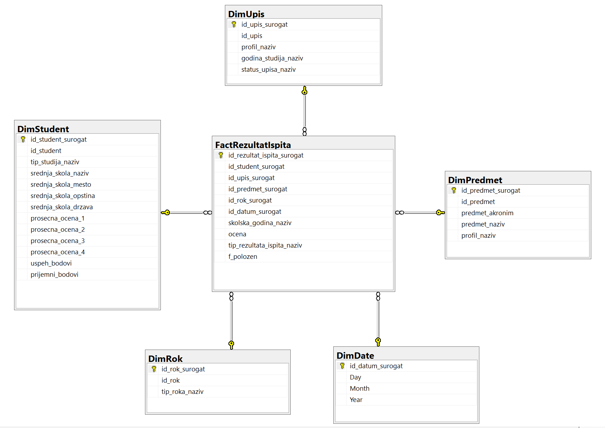

# About the project

This project was developed as part of the *Data Warehousing* course in the *Business Analytics* master’s program at the Faculty of Organizational Sciences, University of Belgrade. The project focuses on constructing a **star schema** data warehouse and implementing an **ETL** (Extract, Transform, Load) pipeline to address key research questions using data from an **OLTP** (Online Transaction Processing) database — **University Student Administration**.

The data used in this project is not real but consists of mixed and anonymized records, serving as a simulation for educational purposes. The ETL process was implemented using **SQL Server Management Studio** (SSMS) and SQL **Server Integration Services** (SSIS).

## Scope of the project - Research questions

This project tracks two main business processes: **monitoring student success** and **analyzing course exam performance**. Each of these processes includes two key research questions, as outlined here:

**Monitoring student success**:
- Do demographic characteristics of students affect their academic success?
- Are high school performance and entrance exam results good predictors of student success in university?

**Analyzing course exam performanse**:
- Are there specific exams that students tend to postpone until the October exam period?
- Does a student’s study program affect their grades in specific subjects?

The first two research questions focus on tracking student success in exams, while the last two questions focus on analyzing subjects and comparing difficulty levels across study modules.

## Project Components

### 1. OLTP Data Source - University Student Administration Database

- The OLTP database is the primary data source, holding detailed transactional data about students, including enrollment, course performance, exam results, and demographic data, provided by the course professor.
- For the full-size picture of the OLTP database, as an ER diagram, [click here](https://raw.githubusercontent.com/NovakMastilovic/SSIS_ETL_University_DB/refs/heads/main/Diagram_OLTP_UniversityDatabase.png).

### 2. Identifying Key Tables from the OLTP Database

To define our Data Warehouse structure (including dimension and fact tables), we analyzed our research questions to identify the relevant tables for inclusion. A BI Model Canvas was used to ensure that the data warehouse would capture all necessary insights by addressing key questions such as: *Who*, *What*, *Where*, *When*, *How*, and *How Many*. Summary of BI model canvas is shown in the Table 1 below:

| Question      | Answered by Table                                                         |
|---------------|---------------------------------------------------------------------------|
| **Who**       | Student                                                                   |
| **What**      | Course, High School, Enrollment                                           |
| **Why**       | Not applicable in this model                                              |
| **Where**     | Place, Municipality, Country                                              |
| **When**      | Exam Date, Exam Period, Academic Year                                     |
| **How**       | Study Type, Exam Type, Enrollment Status, Profile, Course Plan, Academic Year |
| **How Many**  | Exam Results                                                              |

*Table 1 - BI model Canvas*

### 3. Data Warehouse Star Schema Design

Based on the analyzed tables through the BI Model Canvas, the following structure represents the proposed Data Warehouse star schema in *Picture 1*.

*Picture 1 - Data Warehouse Star Schema*

The star schema consists of a central fact table (`FactRezultatIspita`) surrounded by dimension tables (`DimStudent`, `DimPredmet`, `DimRok`, `DimUpis`, `DimDate`). This structure was achieved through a denormalization process, simplifying the OLTP database tables into a structure optimized for analytical queries based on the research questions initially defined.

#### Fact Table
- **`FactRezultatIspita`**: This table serves as the central fact table and records each exam attempt by students.

#### Dimension Tables

- **`DimStudent`**: Created by joining tables `student`, `sif_tip_studija`, `sif_srednja_skola`, `sif_mesto`, `sif_opstina`, and `sif_drzava`. This dimension stores demographic and academic information about each student.

- **`DimPredmet`**: This dimension was created by combining the tables `profil`, `predmeti_po_planovima`, and `predmet` from the OLTP database.

- **`DimRok`**: Created by merging tables `sif_tip_roka` and `sif_rok`, this dimension provides details about the exam period.

- **`DimUpis`**: This dimension contains enrollment details, created from the `upis` table in the OLTP database.

- **`DimDate`**: A necessary dimension for tracking exam dates, even though our research questions do not specifically require a time dimension.

### 4. ETL process

The ETL process was designed to extract data from the original **Studenti** database and load it into the **Studenti_Projekat** Data Warehouse. This process was implemented using SQL Server Management Studio and Visual Studio (SSIS packages). The ETL flow was divided into several packages to handle the loading of dimension and fact tables respectively.

#### 4.1 Package: Execute

The **Execute** package serves as the main orchestrator, controlling the sequence in which all other packages are executed. In this package, we used a sequential container to define the exact order for running each package. The established order ensures that all dimension tables are loaded before the fact table, preserving referential integrity across the data warehouse, as the fact table stores foreign keys for each dimension.

The sequence is organized as follows:
1. Load all dimension tables (`DimDate`, `DimStudent`, `DimRok`, `DimPredmet`, `DimUpis`).
2. Load the fact table (`FactRezultatIspita`).

*Picture 2 - ETL Sequence Container in SSIS*

### 4. ETL Process

The ETL process was developed using SQL Server Management Studio and Visual Studio (SSIS packages) to load data from the **Studenti** database into the **Studenti_Projekat** Data Warehouse - mentioned above. The process is organized into a series of packages, structured to handle both dimension and fact tables.

#### 4.1 Package: Execute

The **Execute** package serves as the main orchestrator, managing the sequence in which all packages are executed. A sequential container defines the order, ensuring all dimension tables are loaded before the fact table to preserve referential integrity.

The execution sequence is as follows:
1. Load all dimension tables (`DimDate`, `DimStudent`, `DimRok`, `DimPredmet`, `DimUpis`).
2. Load the fact table (`FactRezultatIspita`).

#### 4.2 Dimension Packages

Each dimension table is populated through its own dedicated package, consisting of two primary tasks: **Execute SQL Task** and **Data Flow Task**. The **Execute SQL Task** recreates the dimension table before each load to avoid data duplication. The **Data Flow Task** then extracts, transforms, and loads data from relevant source tables, with lookups and transformations.

The dimension packages include:
- **DimStudent**: Aggregates student demographics and high school details from various tables, forming a complete student profile.
- **DimRok**: Loads details for each exam period, ensuring each session is uniquely represented.
- **DimPredmet**: Compiles information on courses, linking subjects to student study programs.
- **DimDate**: Stores exam dates (day, month, year) to support time-based analyses.
- **DimUpis**: Tracks enrollment details, such as academic year, study profile, and enrollment status, by combining data from tables like `profi`, `godina_studija`, and `status_upisa`.

#### 4.3 Fact Package: FactRezultatIspita

The **FactRezultatIspita** package populates the central fact table, which records each student's exam results. This package also includes two tasks:

- **Execute SQL Task**: Creates the `FactRezultatIspita` table and re-establishes foreign key relationships with dimension tables, ensuring referential integrity.
- **Data Flow Task**: Maps exam data to relevant surrogate keys from each dimension table, capturing essential details such as student ID, course, enrollment, and exam period.

Each package is designed to ensure data quality, integrity, and consistency, creating a reliable foundation for analytical reporting in the Data Warehouse.

---

**Project developed as part of the Data Warehousing course, Faculty of Organizational Sciences, University of Belgrade.**
